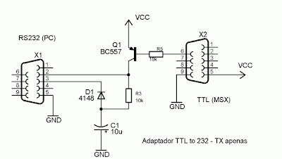

# Digital camera for MSX

## About

This project is an exploration for building a digital camera for MSX(1), a vintage 8 bit computer from 1983. Note that the project is in a very early stage and "work in progress".

## TTL-RS232 interface

## References

[RS232 Shifter Board Kit](https://www.sparkfun.com/products/449)

[RS232 Shifter Board Kit (archive)](https://web.archive.org/web/20070609103145/http://www.sparkfun.com/commerce/product_info.php?products_id=133)

[Interfacing the Serial / RS-232 Port ](https://web.archive.org/web/20070629041613/http://www.beyondlogic.org/serial/serial1.htm#46)

[TTL to RS232 adaptor Explained](https://web.archive.org/web/20070701024011/http://www.uchobby.com/index.php/2007/06/11/ttl-to-rs232-adaptor-explained/)

[Conversor TTL-RS232 (Spanish)](http://hotbit.blogspot.com/2008/01/conversor-ttl-rs232.html)

[LPRINT to Joystick port](http://hotbit.blogspot.com/2008/01/lprint-na-porta-de-joystick.html)

